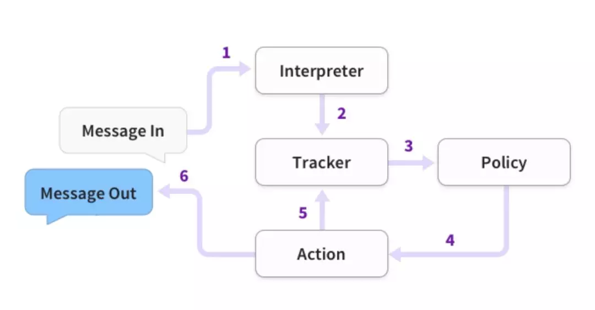
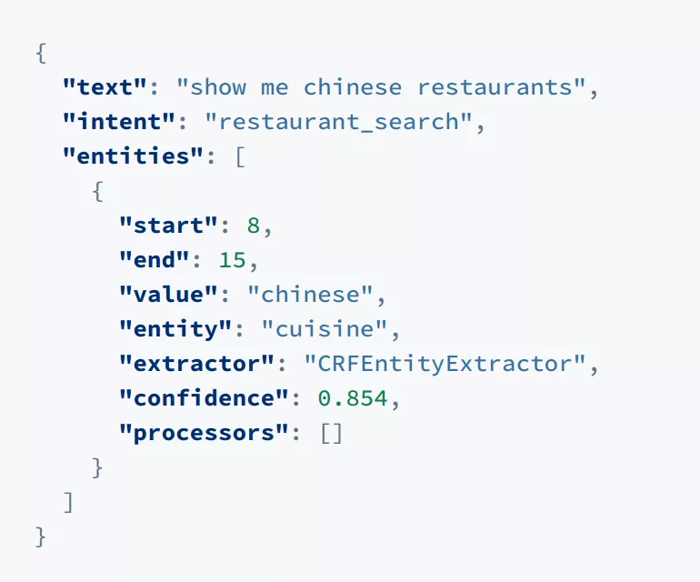

---
layout: post
title:  "rasa（task bot）"
date: 2019-08-20 10:30:00
categories: nlp
tags: [nlp,rasa]
---
<!-- 数学公式 -->

所谓对话系统，是通过对话的方式，实现人机交互的一种方法。

Rasa是一家通过机器学习技术实现对话系统、机器人开发的工具，同时也是一家创业公司。<!-- more -->

##  Rasa的组成 

###  Rasa NLU

主要实现自然语言理解（即NLU）功能，本质上就是识别句子的意图和实体。

如“买一张去北京的票”，我们可以定义一个意图是“购票”，实体是“北京”和“一张”。

意图识别本质是短文本分类任务（当然在学术界可能称为Intent Detection来和Text Classification分开）。单纯短文本分类任务的SOTA基本上就是BERT了。

抽取本质是信息抽取任务。抽取的SOTA现在一般还是BiLSTM-CRF的各种变型，或BERT之类。

现在学术界的主要研究方向是多种工作结合，例如同一模型同时做意图识别和信息抽取，互相配合增加总体准确率。

Rasa的NLU，主要是当前的社区版，主要还是使用了各种开源技术，并没有追求学术上的SOTA。它使用的工具包括Spacy、sklearn-crfsuite

###  Rasa Core

这是Rasa的核心部分，NLU有各种实现，开源的也有snips nlu等，但是core却独一无二。

Rasa Core主要完成了基于故事的对话管理，包括解析故事并生成对话系统中的对话管理模型（Dialog Management），输出系统决策（System Action/System Policy）。

学术上一般认为这部分会包含两个模型

    1、对话状态跟踪（Dialog State Tracking / Belief Tracking）

    2、对话策略（Dialog Policy / Policy Optimization）

对于1.其实Rasa实现很简单，具体在它的论文 Few-Shot Generalization Across Dialogue Tasks, Vlasov et at., 2018 中说的比较具体。就是简单的基于策略的槽状态替换。

对于2.Rasa使用基于LSTM的Learn to Rank方法，大体上是将当前轮用户意图、上一轮系统行为、当前槽值状态向量化，然后与所有系统行为做相似度学习，以此决定当前轮次的一个或多个系统行为

###  Rasa  的 Pipeline

Pipeline 的过程是这样的：

1、用户输入文字，送入解释器，即Rasa NLU

2、NLU给出结果，如图

3、从Tracker到Policy，Tracker用于跟踪对话状态，Tracker输出的是Embedding

    用户意图的Embedding

    系统动作（上一步）的Embedding

    实体（槽值/Slot）的Embedding

4、Policy给出系统行为

5、Tracker记录系统行为，下一次会提供给Policy使用

6、返回消息给用户